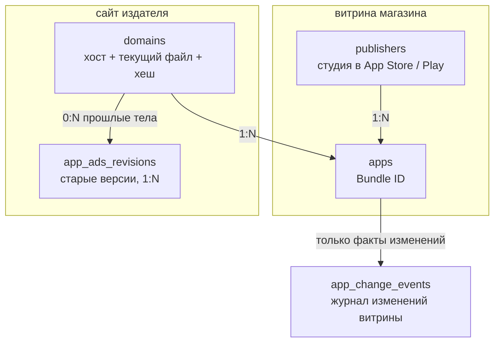
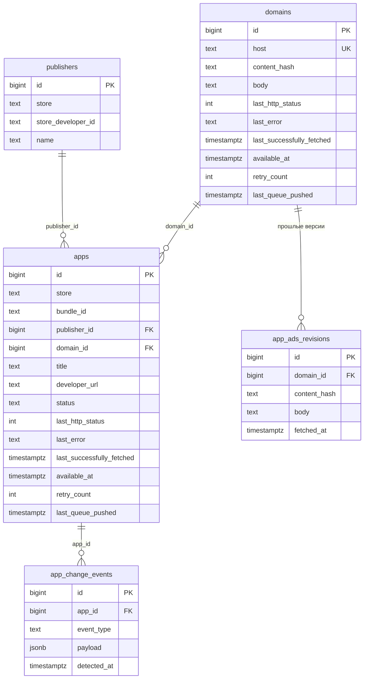

# Схема базы (PostgreSQL)

Источник правды — Postgres. `app-ads.txt` живёт **на домене издателя**, не на Bundle ID: десятки миллионов приложений схлопываются в меньшее число доменов.

Redis — очередь и локи, не файлы. Сырой `.txt` в S3 не выносим: файлы крошечные, достаточно `TEXT` + хеш.

## Зачем столько таблиц

Два разных цикла обновления:

| Джоба | По чему идём | Что меняется |
|---|---|---|
| Daily | домены | содержимое `app-ads.txt` |
| Weekly | приложения | владелец, имя, сайт, удаление |

Если хранить файл в строке приложения, один и тот же текст продублируется на все игры студии. Поэтому приложения и домены разведены.

## Блок-схема сущностей



Связи:

- у приложения всегда есть (после первого удачного scrape) издатель и, если на витрине был сайт, домен;
- много приложений SuperGames → одна строка `example-publisher.com`;
- daily не трогает `apps`, weekly не перечитывает `.txt`.

## ER-диаграмма



## Таблицы

Интервалы и `$queue_lease` — env, в SQL параметрами.

Планировщик (короткая транзакция, потом Redis):

```sql
SELECT id FROM domains
WHERE (last_successfully_fetched IS NULL
       OR last_successfully_fetched <= now() - $app_ads_interval)
  AND (available_at IS NULL OR available_at <= now())
  AND (last_queue_pushed IS NULL
       OR last_queue_pushed <= now() - $queue_lease)
FOR UPDATE SKIP LOCKED
LIMIT $scheduler_batch_size;
-- UPDATE … SET last_queue_pushed = now()  по выбранным id
```

Для `apps` то же с `$store_interval`.

Успех воркера: `last_successfully_fetched = now()`, `retry_count = 0`, `available_at = NULL`.  
Ретрай (429/сеть/капча): `retry_count++`, `available_at = now() + backoff(n)` — **без** сдвига `last_successfully_fetched`.  
404 `app-ads.txt` — успех проверки: периода хватает, в экспоненту не крутим.

Индексы: `(last_successfully_fetched)`, `(last_queue_pushed)` на обеих таблицах.

### `publishers`

Студия **в конкретном магазине**. Apple seller id и Google developer id — разные миры, поэтому уникальность `(store, store_developer_id)`.

| Колонка | Тип | Зачем |
|---|---|---|
| `id` | `bigint` PK | |
| `store` | `text` (`ios` / `android`) | |
| `store_developer_id` | `text` | ID разработчика на витрине |
| `name` | `text` | имя на витрине, ловим переименование студии |
| `updated_at` | `timestamptz` | |

### `domains`

Один хост = один `GET https://{host}/app-ads.txt`. Актуальное тело и его хеш лежат **здесь**. Хеш — чтобы daily сравнивал отпечаток, не вычитывая `body` из TOAST.

| Колонка | Тип | Зачем |
|---|---|---|
| `id` | `bigint` PK | |
| `host` | `text` UNIQUE | нормализованный хост, без схемы и пути |
| `body` | `text` NULL | текущий файл; перезаписывается при смене хеша |
| `content_hash` | `char(64)` NULL | sha256 текущего `body` |
| `etag` | `text` NULL | для `If-None-Match` |
| `last_modified` | `text` NULL | для `If-Modified-Since` |
| `last_http_status` | `int` NULL | 200 / 404 / 403 / 0 = сеть |
| `last_error` | `text` NULL | кратко, без стека |
| `last_successfully_fetched` | `timestamptz` NULL | последний **успех**; ритм = это + env |
| `available_at` | `timestamptz` NULL | стоп до этого момента; только ретраи |
| `retry_count` | `int` NOT NULL default 0 | сбрасывается на успехе |
| `last_queue_pushed` | `timestamptz` NULL | claim планировщика; lease из env |
| `last_changed_at` | `timestamptz` NULL | когда хеш реально сменился |

`host` нормализуем один раз при разборе URL с витрины (lowercase, без `www` по правилам IAB, без пути и порта). Fallback «сначала субдомен, потом корень» — логика воркера; в базе храним тот хост, **с которого в итоге взяли файл**, плюс при желании исходный URL в `apps.developer_url`.

### `apps`

Входная сущность: Bundle ID.

| Колонка | Тип | Зачем |
|---|---|---|
| `id` | `bigint` PK | |
| `store` | `text` | |
| `bundle_id` | `text` | |
| `publisher_id` | `bigint` NULL FK | кто сейчас владелец |
| `domain_id` | `bigint` NULL FK | откуда сейчас берём `app-ads.txt` |
| `title` | `text` NULL | чтобы увидеть переименование |
| `developer_url` | `text` NULL | сырой URL с витрины, до нормализации в `host` |
| `status` | `text` | `active` / `removed` / `not_found` — витрина, не HTTP |
| `last_http_status` | `int` NULL | последний ответ Lookup/Play (429, 0 = сеть) |
| `last_error` | `text` NULL | кратко: captcha, timeout… |
| `last_successfully_fetched` | `timestamptz` NULL | последний успешный weekly |
| `available_at` | `timestamptz` NULL | backoff ретрая |
| `retry_count` | `int` NOT NULL default 0 | |
| `last_queue_pushed` | `timestamptz` NULL | claim планировщика |
| `created_at` | `timestamptz` | |
| `updated_at` | `timestamptz` | |

Уникальность: `(store, bundle_id)`.  
Индексы: `(last_successfully_fetched)`, `(last_queue_pushed)`, `(domain_id)`, `(publisher_id)`.

`domain_id` стоит на приложении, а не только на издателе: weekly смотрит **страницу приложения**. Сайт на витрине может смениться у одной игры раньше, чем у остальных.

### `app_ads_revisions`

Это **не** 1:1 с `domains`. Текущий файл — колонки `body` / `content_hash` у домена. Эта таблица — архив **прошлых** тел: `domains` 1 → N `app_ads_revisions`.

Зачем отдельная таблица, если актуальное и так в `domains`: чтобы ответить «каким файл был 3 марта», не смешивая историю со строкой, по которой ходит daily. Если история содержимого для верификации не нужна — таблицу можно не делать: задание требует *обнаружить* изменение, не обязательно хранить все прошлые версии.

Когда хеш сменился: старый `body` копируем в `app_ads_revisions`, потом перезаписываем поля на `domains`. Daily при том же хеше архив не трогает: только `last_successfully_fetched`.

| Колонка | Тип | Зачем |
|---|---|---|
| `id` | `bigint` PK | |
| `domain_id` | `bigint` FK | |
| `content_hash` | `char(64)` | |
| `body` | `text` | прошлое тело |
| `fetched_at` | `timestamptz` | когда эта версия стала неактуальной (или когда её сняли) |

Уникальность: `(domain_id, content_hash)` — не плодим дубликаты, если файл качнулся туда-обратно.

### `app_change_events`

Журнал weekly. Не пишем строку на каждую проверку «всё как было», только факт.

| Колонка | Тип | Зачем |
|---|---|---|
| `id` | `bigint` PK | |
| `app_id` | `bigint` FK | |
| `event_type` | `text` | `publisher_changed` / `renamed` / `removed` / `url_changed` / `domain_changed` / `reappeared` |
| `payload` | `jsonb` | `{ "old": ..., "new": ... }` |
| `detected_at` | `timestamptz` | |

Индекс: `(app_id, detected_at desc)`.

Текущее состояние — в `apps` / `publishers`. Эта таблица нужна, чтобы ответить «что случилось», не восстанавливая историю по диффам снапшотов витрины. Полные HTML магазинов не храним.

## Как это выглядит на учебном примере

SuperGames, сайт `example-publisher.com`, две игры:

```
publishers:  (ios, seller_42, "SuperGames")

domains:     host=example-publisher.com
             content_hash=abc…
             body="google.com, pub-1234, DIRECT, …"

apps:        (ios, com.supergames.one)  → publisher + domain
             (ios, com.supergames.two)  → тот же publisher + тот же domain

app_ads_revisions:  пока пусто (ещё не было смены файла)
```

На следующий день файл тот же → `revisions` пустой, на `domains` обновляется только `last_successfully_fetched`. Файл сменился → старый `body` уходит в `revisions`, на `domains` новый текст и хеш. Через неделю Google Play пишет другого разработчика у первой игры → `apps.publisher_id` обновляется, в `app_change_events` одна строка `publisher_changed`.

## Чего в Postgres нет

- Очередь раздачи — Redis list. Claim «уже в очереди» — `last_queue_pushed` в Postgres, не Redis.
- Лог каждого daily-HTTP (миллионы строк в день) — не храним; статус последней попытки на `domains`.
- Разобранные строки `DIRECT`/`RESELLER` отдельной таблицей — можно навесить позже поверх `domains.body`; для сбора и актуализации достаточно сырого файла.
- Интервалы обновления — env, не таблица.
